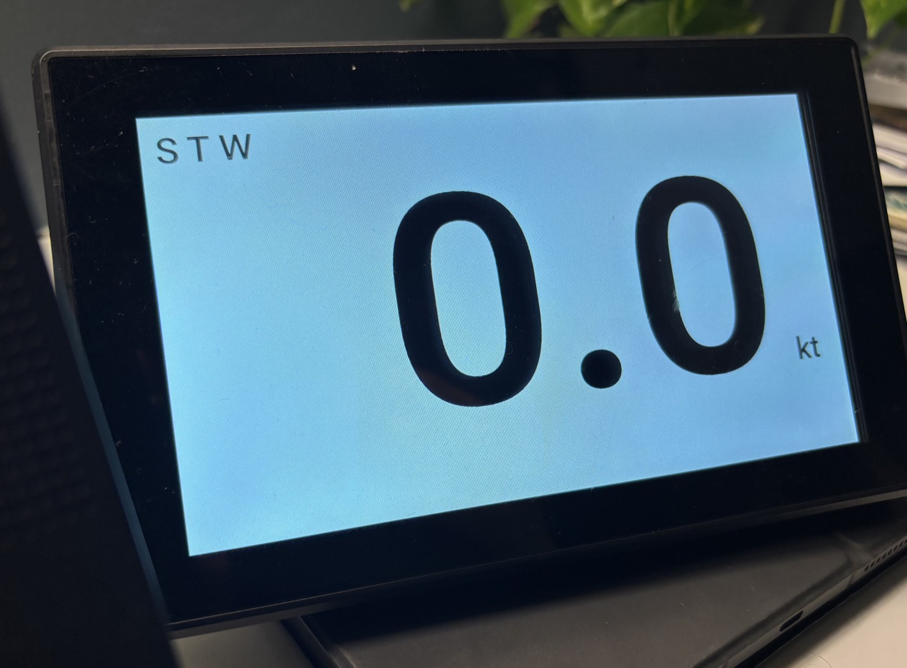

# signalk-bignumbers

Big, high-contrast number displays for [SignalK](https://signalk.org) —
mast and repeater screens for racing, showing one, two or three values
large enough to read from the rail.



It is deliberately **not an MFD**: no charts, no gauges, no graphs or
history, nothing to touch. Just the numbers, as large, as current and as
legible as the screen allows, for someone who has half a second to look
up mid-manoeuvre.

Values render the moment each SignalK delta arrives — nothing is
buffered, batched, rate-limited or smoothed on the way to the screen.
See [Latency and load](#latency-and-load).

A display is anything with a browser — a Raspberry Pi with an HDMI panel,
a phone, a tablet, a laptop. They all open the same page, and none of them
needs anything installed.

Each display knows only the name in its URL. What it shows is stored on
the SignalK server and managed from a web page, so changing what a display
shows doesn't mean touching it.

## The webapp


One row per display, showing what it's currently set to. **Edit** changes
it, and the display picks the change up within about 5 seconds.

On a kiosk Pi the name is the hostname, filled in by systemd, so every Pi
runs the same service file. A display with no entry in the list shows its
own name instead:


So setting one up is: plug it in, read the name off the screen, add it to
the list.

## What can be a display

The instrument is one static HTML page, no build step and no
dependencies, so most things with a browser will run it.

| Display | How it opens the page |
|---|---|
| Raspberry Pi Zero 2 W + HDMI panel | boots into it fullscreen, hostname as its name ([guide](docs/raspberry-pi-kiosk.md)) |
| iPhone / iPad | open the URL in Safari, **Add to Home Screen** |
| Android phone or tablet | same, via Chrome's **Add to Home screen** |
| Laptop | any browser, fullscreen |

Below is the `phone` row from the list above — the same page as the mast
Pis, with a different stored config:


Going from one value to three was **+ Add another number** in the webapp.
Nothing on the phone changed.

An old phone makes a good repeater. The mast wants a Pi, which comes back
on its own after a power cut and doesn't mind the rain.

Set a phone or tablet to never auto-lock. The page holds no wake-lock, so
the screen timeout will take it off the air.

## Latency and load

**Late data is worse than no data.** A number two seconds old looks
current, and nothing on screen says otherwise. Someone is trimming to it.

So as little as possible sits between the delta and the glass:

- Subscriptions use `policy: "instant"`, no `period`, no `minPeriod`.
  Values arrive as they change, not on a timer.
- Each delta renders synchronously on arrival. No queue, no
  `requestAnimationFrame`, no `setTimeout`, no batching.
- Nothing animates. A tweened number shows readings the boat never took,
  and shows them late; value changes carry `transition: none`.
- No smoothing, averaging or damping. Damping belongs upstream in
  SignalK, where every display gets it.
- No history, replay or backfill. A reconnected display shows the next
  live value, not what it missed.

There's no rate limit either, so a 10 Hz source updates the screen ten
times a second. That stays cheap:

- A display receives only the paths it shows. The socket opens
  `?subscribe=none` and subscribes by path, so the rest of the bus is
  never sent, however busy.
- Between deltas nothing paints. CPU follows the data rate, not the clock.
- An update writes the sign and digits, nothing else. Digit widths are
  reserved, so a new value doesn't reflow or resize the text;
  `fitDisplay()` runs at startup and on resize, not per value.
- Past the refresh rate the browser coalesces writes into one paint, so a
  source faster than the panel costs parsing, not drawing.

No framework, no bundler, no dependencies. If a Pi still can't keep up,
cut values or slow the source — never buffer.

## What's here

- **`public/index.html`** — the webapp. Lists every configured display,
  and adds, edits and deletes them.
- **`public/instrument.html`** — the display itself. Fills the screen
  with up to three numbers, autosized to fit.
- **`docs/raspberry-pi-kiosk.md`** — how to build a display from a Pi.
- **`dev/dummy_signalk.py`** — a fake SignalK server that sweeps values
  through a range, for testing the display without a boat.

## Install

It's a SignalK webapp — static files, no plugin and no backend.

In the server's admin UI, find `signalk-bignumbers` under *Appstore →
Available*, install it and restart the server. It then appears in the
Webapps menu.

Or by hand:

```bash
cd ~/.signalk
npm install signalk-bignumbers
sudo systemctl restart signalk    # or however your server is run
```

For the development version, install from the repo instead:
`npm install ghotihook/signalk-bignumbers`.

## How a display gets configured

1. A screen opens `instrument.html?display=<name>` — a Pi boots into it
   with its hostname (see the [kiosk setup
   guide](docs/raspberry-pi-kiosk.md)); a phone or laptop just bookmarks
   the URL with a name you pick.
2. With nothing stored under that name, the screen shows the name in
   large text.
3. In the webapp, add that name, choose an instrument and colours, and
   save. **+ Add another number** puts a second or third value on the
   same screen.
4. The display picks it up within about 5 seconds. No restart, no SSH.

Two or three values split the screen into equal horizontal bands, top to
bottom in the order they're listed. Each band has its own colours, and all
render at the same digit size so the screen reads as one instrument. Where
two neighbouring bands share a background a hairline divides them; where
the background changes, the change of colour is the divide.

Configs live in signalk-server's built-in `applicationData` store, keyed
by that name. Displays read it anonymously; saving requires a SignalK
login, which the webapp prompts for.

## Reading the screen

The same principle from the other side: if a reading can't be trusted,
the screen has to say so rather than keep showing it.

If a value goes 3 seconds without an update it drops to grey dashes
rather than holding its last reading, so a dead sensor or a dropped feed
looks obviously dead instead of looking like a becalmed boat. The dot in
the top-right corner is green while the connection to SignalK is live and
dark red when it isn't; a dropped connection retries every second and
recovers on its own, showing the next live value rather than replaying
what was missed.

Digits never shift sideways as the value changes — the layout reserves
width for every digit and for the minus sign, so the number stays still
enough to read from a moving boat.

## Direct URLs

A display can also be configured entirely from its URL, with no stored
config — useful for testing, or for a one-off screen:

```
instrument.html?path=environment.wind.speedApparent&name=AWS&layout=xx.xx&unit=kt&factor=1.9438444924406
```

| Parameter | Meaning |
|---|---|
| `path` | SignalK path to subscribe to (required) |
| `name` | Label shown top-left of the band (required) |
| `field` | Key to read from a compound value, e.g. `roll` |
| `layout` | Digit template, e.g. `xxx` or `xx.xx` — sets the autosize and decimal places |
| `neg` | `true` to reserve room for a minus sign |
| `unit` | Label shown after the number |
| `factor`, `offset` | Unit conversion: `shown = raw * factor + offset` |
| `bg`, `fg` | Theme colours for this value's band; unsuffixed they also set the screen's. Hex only (`#000000`, `#fff`) — anything else is ignored |
| `host` | SignalK server, if not the one serving the page (whole screen) |
| `display` | Stored-config identifier — used *instead of* all of the above |

For a second and third value, suffix every per-value key with `2` and `3`.
The unsuffixed keys are the first value, so any single-value URL keeps
meaning exactly what it always did (wrapped here for readability — it's
one line):

```
instrument.html?path=navigation.speedOverGround&name=SOG&layout=xx.x&unit=kt&factor=1.9438444924406
               &path2=environment.depth.belowTransducer&name2=DPT&layout2=xx.x&unit2=m
               &path3=navigation.attitude&field3=roll&name3=Heel&layout3=xx&neg3=true&unit3=%C2%B0&factor3=57.29577951308232
```

A missing `path2` ends the list, so values can't have gaps. `host` and
`display` belong to the display as a whole and are never suffixed.

`bg` and `fg` do double duty: suffixed (`bg2`, `fg3`) they colour just
that band, and unsuffixed they set both the first band's colours and the
screen's — the latter being what shows behind the "not configured" and
error screens, which exist before there are any bands.

The webapp's **Preview** button builds these URLs for you.

## License

MIT — see [LICENSE](LICENSE). Bundles
[Roboto](https://fonts.google.com/specimen/Roboto), Apache License 2.0.
