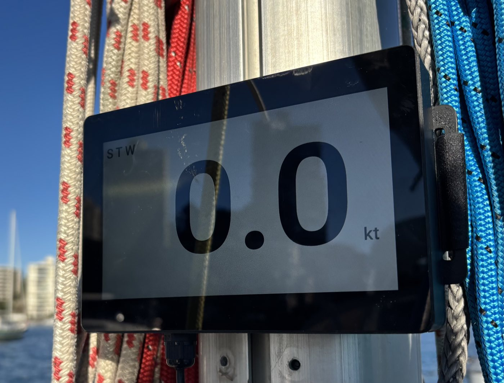
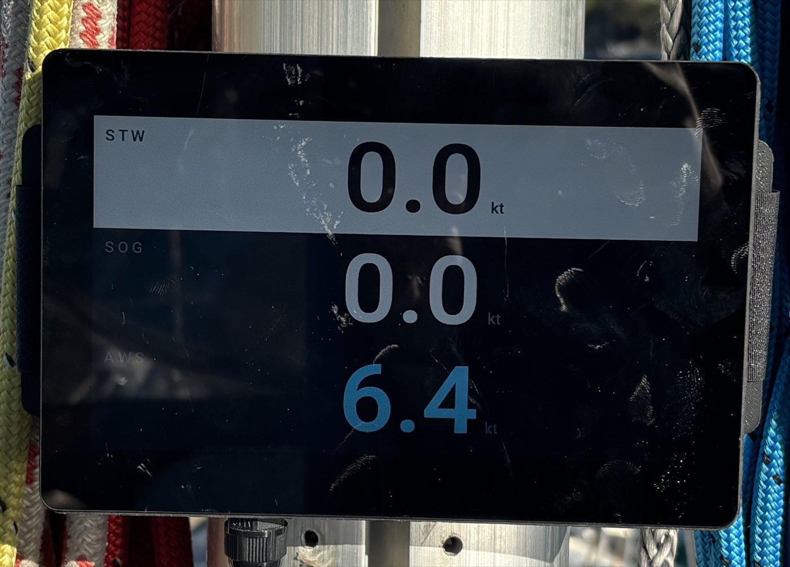
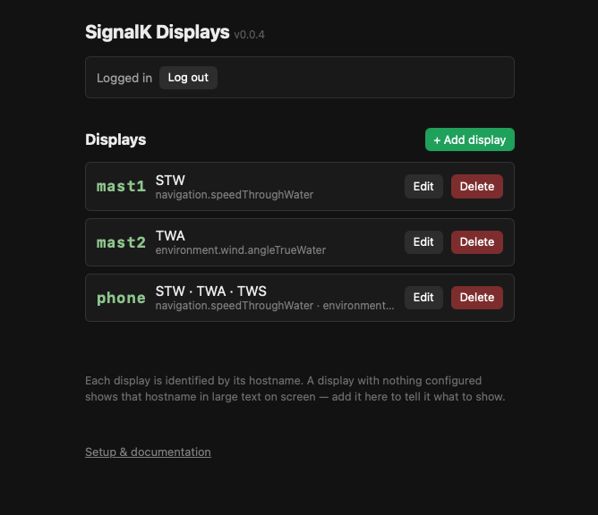
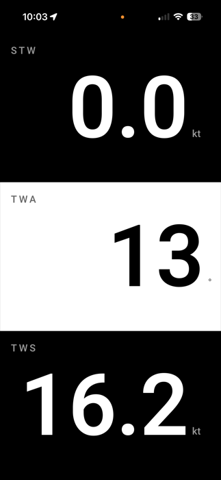
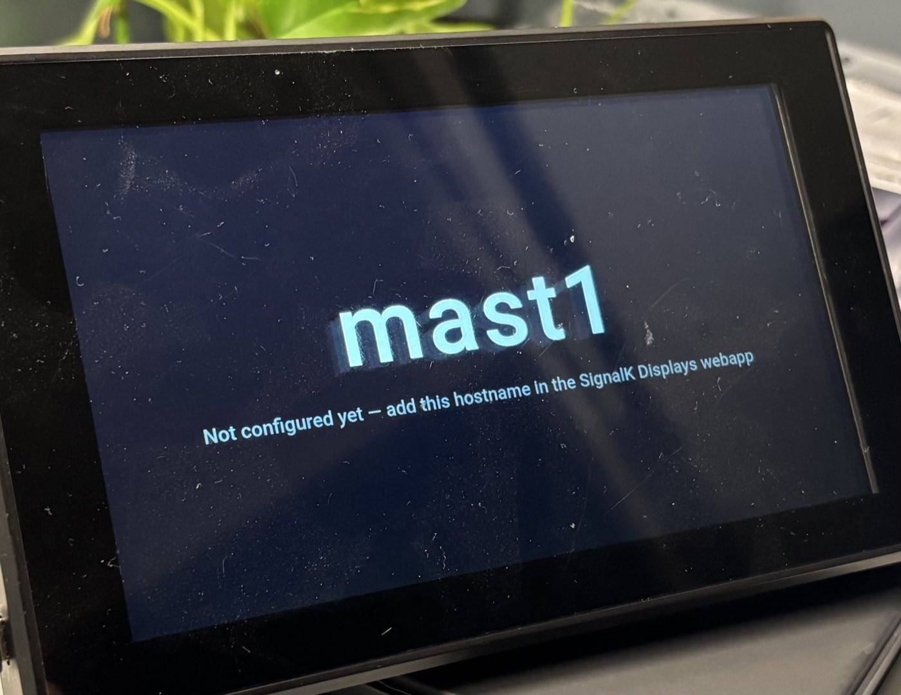
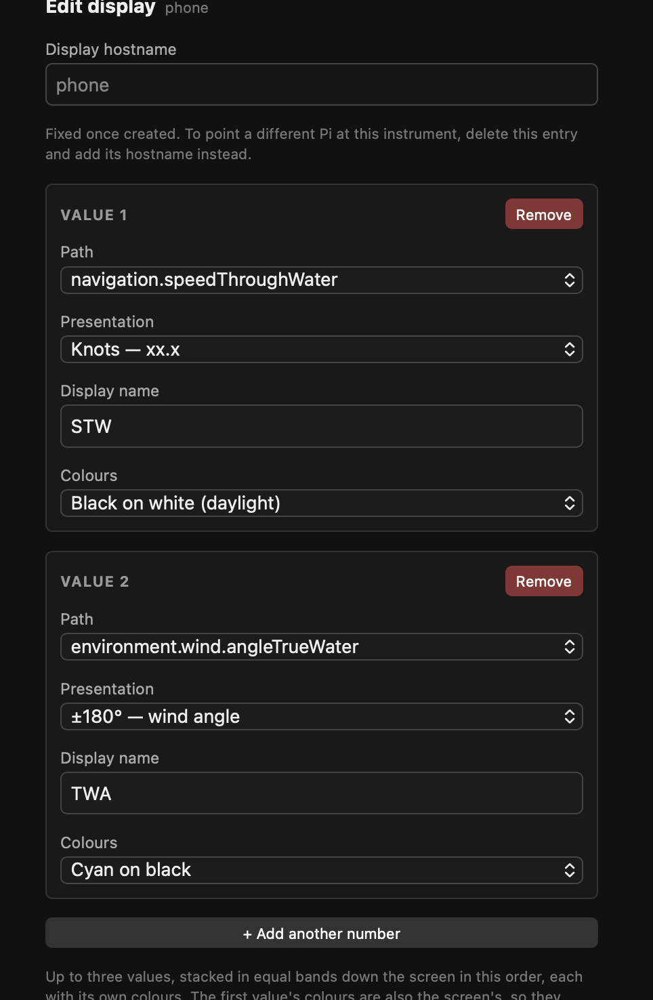

# signalk-bignumbers

Big, high-contrast number displays for [SignalK](https://signalk.org) —
mast and repeater screens for racing, showing one, two or three values
large enough to read from the rail.



## Why this exists

A racing repeater has to do three things, and it has to do all three or
it isn't worth the screen:

- **Perform.** What's on the mast has to be what the instrument is
  reading right now, at whatever rate the sensor produces it — someone is
  trimming to it.
- **Be readable.** At a glance, from metres away, at an angle, in spray,
  in anything from full sun to full dark.
- **Be trivial to deploy.** Minutes from a bare screen to a live number,
  with nothing installed and nothing configured on the display itself.

How it meets them — and it does nothing else:

**Fast.** A delta arrives and paints. No queue, no batch, no
`requestAnimationFrame`, no animation to tween through. See [Latency and
load](#latency-and-load).

**No buffering, no rate limits.** Nothing between the data and the screen
runs on a timer. Subscriptions are `policy: "instant"` with no `period`
and no `minPeriod`, so values arrive as they change rather than on a
schedule, and a 10 Hz source updates the screen ten times a second.
Nothing is smoothed, averaged or damped on the
way through — damping is latency wearing a different hat, and belongs
upstream in SignalK where every display gets it. Given the choice between
showing an update late and not showing it, this drops it.

**Large, clear numbers.** One value fills the screen; three still fill a
third each, all at the same digit size so the screen reads as one
instrument. Fixed high-contrast themes, not a colour picker — nothing you
can select washes out in sun or wrecks night vision.

**Digits that don't jump.** A number whose digits shift sideways as it
changes can't be read from a moving boat: the eye re-finds the decimal
point every update instead of taking the value in at a glance. So the
layout is fixed before any value arrives. The digit template (`xx.x`)
reserves a column per digit, the figures are `tabular-nums` so every
glyph is the same width, leading zeros are hidden rather than removed so
they keep occupying their space, and a value that can go negative
reserves its minus column whether or not it's currently using it. 9.9 to
10.0 and back moves nothing but the digits themselves.

**No bloat.** Two static HTML pages. No build step, no bundler, no
framework, no runtime dependencies, no backend, no plugin. Light enough
that a Pi Zero 2 W runs a display with headroom to spare.

**Nothing to install, nothing to configure — on the display.** Anything
with a browser is a display the moment you open a URL on it: a phone, an
old iPad, a laptop, a Pi with an HDMI panel. Deploying one is open the
URL, read the name off the screen, add it in the webapp. Configuring it
is picking an instrument from a dropdown — the preset fills in the path,
the unit conversion and the digit format. A display holds no config and
no credentials of its own, so changing what it shows never means touching
it again.

It is deliberately **not an MFD**: no charts, no gauges, no graphs, no
history, no AIS, no alarms, nothing to touch. Anything on screen that
isn't a number, its label or its unit costs reading distance.

The one place it deliberately shows less: a value that stops updating for
3 seconds drops to grey dashes rather than holding its last reading, so a
dead sensor looks dead instead of looking like a becalmed boat.



## Quick start

Five minutes, using a phone as the display. Nothing to install on the
phone, and nothing here is a decision you're stuck with.

**1. Install the webapp** on the SignalK server — the only thing that
gets installed anywhere:

```bash
cd ~/.signalk
npm install github:ghotihook/signalk-bignumbers
sudo systemctl restart signalk    # or however your server is run
```

**SignalK Displays** then appears in the server's Webapps menu. See
[Installing and updating](#installing-and-updating) for what that command
does.

**2. Open this on the phone.** Substitute your own server address for
`signalk.local:3000` throughout — it's the same host and port you use to
reach SignalK's admin UI.

```
http://signalk.local:3000/signalk-bignumbers/instrument.html?display=phone
```

The screen fills with the word `phone` and "Not configured yet". That's
the display telling you its name and that nothing is stored under it,
which is exactly right — and it proves the network path to SignalK works.

`phone` is just a label you chose in the URL. Pick anything; you'll type
the same word in the next step.

**3. Tell it what to show.** From any browser — the phone, a laptop,
anything — open `http://signalk.local:3000/signalk-bignumbers/` (also in
SignalK's Webapps menu). Log in at the top, **+ Add display**, type
`phone`, pick an instrument, **Save**.



**4. Watch the phone.** Within about 5 seconds it switches from its name
to the number. No reload, no restart.



That phone is now done. Changing what it shows is **Edit** in that list,
and going from one value to three is **+ Add another number** — nothing
on the phone changes either time.

## Proper install

The quick start is already the whole software install — the webapp is the
only thing that ever gets installed anywhere. What's left is making a
device stay on the air unattended.

Both kinds of display work identically once running. They differ in one
thing only: **where the name comes from.** On a phone or tablet you type
it into the URL. On a Pi, systemd fills in the hostname, so the same
service file works on every Pi in the fleet and nothing is typed twice.

### Phone or tablet

Best for a repeater someone carries, or a screen taped up for a race and
taken home after. An old iPad in a waterproof case makes a good mast
display; a phone makes a good pit or bow repeater.

1. Open the display URL in Safari or Chrome, with a name you pick:
   `.../instrument.html?display=bow`
2. **Add to Home Screen** — it launches fullscreen, with no address bar.
3. **Turn off auto-lock.** The page holds no wake-lock, so a screen
   timeout takes the display off the air. On iOS: *Settings → Display &
   Brightness → Auto-Lock → Never*.
4. Keep it on power. A bright screen showing live data is not a light
   load on a battery.
5. Optional, for a screen the crew shouldn't be able to navigate away
   from: iOS *Guided Access* (*Settings → Accessibility → Guided
   Access*), triple-click to lock it to the page.

Name it for where it goes — `bow`, `pit`, `helm` — not for the device.
Swapping in a different phone is then one URL to open, with nothing to
change in the webapp.

### Raspberry Pi Zero 2 W (permanent mast display)

Best for a screen that lives on the boat: it comes up by itself on power,
has no battery to charge or lock screen to swipe past, and doesn't mind
the rain.

Full walkthrough: **[docs/raspberry-pi-kiosk.md](docs/raspberry-pi-kiosk.md)**.
In outline:

1. Raspberry Pi OS (Trixie) console-only, no desktop.
2. `sudo apt install -y cog` — a minimal WPE WebKit shell that renders
   straight to the framebuffer via DRM/KMS. No X11, no Wayland, no
   compositor between the delta and the glass.
3. Test by hand:
   `cog --platform=drm "http://signalk.local:3000/signalk-bignumbers/instrument.html?display=$(hostname)"`
4. Make it permanent with a systemd unit using `%H` in place of the
   hostname, so the file is identical on every Pi.
5. Free tty1 (`systemctl disable getty@tty1`) and add `consoleblank=0` to
   `/boot/firmware/cmdline.txt`.

Because the name is the hostname, deploying one is: name the Pi, plug it
in, read the name off its screen, add it in the webapp.



It's extremely light weight and runs easily on a Pi Zero 2 W, with plenty
of headroom left over.

### What else can be a display

The instrument is one static HTML page — no build step, no framework, no
dependencies — so most things with a browser will run it.

| Display | How it opens the page |
|---|---|
| Raspberry Pi Zero 2 W + HDMI panel | boots into it fullscreen, hostname as its name ([guide](docs/raspberry-pi-kiosk.md)) |
| iPhone / iPad | Safari, **Add to Home Screen** |
| Android phone or tablet | Chrome, **Add to Home screen** |
| Laptop | any browser, fullscreen |

Mixed fleets are managed from one list, with no distinction between a
mast Pi and a borrowed phone.

---

# Reference

## Installing and updating

It's a SignalK webapp — static files, no plugin and no backend. It isn't
on the npm registry, so it isn't in SignalK's Appstore either; install it
straight from GitHub, which gets the current `main`:

```bash
cd ~/.signalk
npm install github:ghotihook/signalk-bignumbers
sudo systemctl restart signalk    # or however your server is run
```

`github:owner/repo` tells npm to clone the repo rather than look the name
up in the registry. Add `#<tag>` or `#<branch>` to pin a version instead
of tracking `main`:

```bash
npm install github:ghotihook/signalk-bignumbers#0.0.5
```

Updating is the same command again — npm re-clones — followed by a
restart. `cd ~/.signalk` matters: signalk-server scans that directory's
`node_modules` for webapps at startup, so installing anywhere else leaves
it invisible.

Once the server restarts, **SignalK Displays** appears in its Webapps
menu, and the pages are served at
`http://<your-server>:3000/signalk-bignumbers/`.

## The webapp

One row per display, showing what it's currently set to. **Edit** changes
it and the display picks the change up within about 5 seconds; **Delete**
sends it back to showing its own name, ready to be reassigned. A
display's name is fixed once created.



Per value:

| Field | Meaning |
|---|---|
| **Instrument** | A preset — AWS, TWA, SOG, STW, HDG, Depth, Heel, BATT and others. Fills in everything below. |
| **Colours** | Fixed high-contrast pairs, not a colour picker. Red or amber on black preserve night vision; black on white or black on amber read better in direct sun. |
| **Display name** | The label above the number. |
| **Path** / **Field** | SignalK path, and the key to read from a compound value (e.g. `roll` from `navigation.attitude`). |
| **Factor** / **Offset** | Unit conversion from SignalK's SI units: `shown = raw * factor + offset`. |
| **Unit** | Label after the number. |
| **Layout** | Digit template, e.g. `xxx` or `xx.x` — sets the autosize and the decimal places. |
| **Negative** | Reserves a column for the minus sign, so digits don't shift when the value goes negative. |
| **Wrap to ±180°** | Folds the converted value into −180…180, for sources that send wind angle as 0…360. |

**+ Add another number** puts a second or third value on the same screen.
They split it into equal horizontal bands, top to bottom in the order
listed, each with its own colours, all at the same digit size so the
screen reads as one instrument. Where two neighbouring bands share a
background a hairline divides them; where the background changes, the
change of colour is the divide.

Mixed backgrounds are worth using sparingly — they cost some of the dark
adaptation the night themes exist to protect.

**Preview** opens the config in a new tab before saving.

## Configuration and permissions

Configs live in signalk-server's built-in `applicationData` store, keyed
by the display's name. Displays read it anonymously; saving requires a
SignalK login, which the webapp prompts for and keeps in the browser's
`localStorage`.

A display holds no credentials, so if signalk-server's security is on it
needs **Security → Settings → Allow Readonly Access** enabled, or nothing
reaches the screen at all. The webapp checks this on load and warns if
it's off, and a display that can't read its config says so rather than
falling through to the "not configured" screen.

An unconfigured display polls every 5s waiting for a config to appear; a
running one re-checks its own config every 5s and reloads if it changed.
Restarting a display to change what it shows is never necessary.

## Reading the screen

- A value with no update for 3 seconds drops to **grey dashes**. It never
  holds a stale reading.
- The **dot top-right** is green while the connection to SignalK is live,
  dark red when it isn't. A dropped connection retries every second and
  recovers on its own, showing the next live value rather than replaying
  what was missed.
- Digits never shift sideways: the layout reserves width for every digit
  and for the minus sign.

## Latency and load

**Late data is worse than no data.** A number two seconds old looks
current, and nothing on screen says otherwise. Someone is trimming to it.

So as little as possible sits between the delta and the glass:

- Subscriptions use `policy: "instant"`, no `period`, no `minPeriod`.
  Values arrive as they change, not on a timer.
- Each delta renders synchronously on arrival. No queue, no
  `requestAnimationFrame`, no `setTimeout`, no batching.
- Nothing animates. A tweened number shows readings the boat never took,
  and shows them late; value changes carry `transition: none`.
- No smoothing, averaging or damping. Damping belongs upstream in
  SignalK, where every display gets it.
- No history, replay or backfill. A reconnected display shows the next
  live value, not what it missed.

There's no rate limit either, so a 10 Hz source updates the screen ten
times a second. That stays cheap:

- A display receives only the paths it shows. The socket opens
  `?subscribe=none` and subscribes by path, so the rest of the bus is
  never sent, however busy.
- Between deltas nothing paints. CPU follows the data rate, not the clock.
- An update writes the sign and digits, nothing else. Digit widths are
  reserved, so a new value doesn't reflow or resize the text;
  `fitDisplay()` runs at startup and on resize, not per value.
- Past the refresh rate the browser coalesces writes into one paint, so a
  source faster than the panel costs parsing, not drawing.

If a Pi still can't keep up, cut values or slow the source — never
buffer.

## Direct URLs

A display can be configured entirely from its URL, with no stored config
and no login anywhere — useful for testing, or for a one-off screen:

```
instrument.html?path=environment.wind.speedApparent&name=AWS&layout=xx.xx&unit=kt&factor=1.9438444924406
```

| Parameter | Meaning |
|---|---|
| `path` | SignalK path to subscribe to (required) |
| `name` | Label shown top-left of the band (required) |
| `field` | Key to read from a compound value, e.g. `roll` |
| `layout` | Digit template, e.g. `xxx` or `xx.xx` — sets the autosize and decimal places |
| `neg` | `true` to reserve room for a minus sign |
| `wrap` | `true` to fold the converted value into −180…180 |
| `unit` | Label shown after the number |
| `factor`, `offset` | Unit conversion: `shown = raw * factor + offset` |
| `bg`, `fg` | Theme colours for this value's band; unsuffixed they also set the screen's. Hex only (`#000000`, `#fff`) — anything else is ignored |
| `host` | SignalK server, if not the one serving the page (whole screen) |
| `display` | Stored-config identifier — used *instead of* all of the above |

For a second and third value, suffix every per-value key with `2` and `3`.
The unsuffixed keys are the first value, so any single-value URL keeps
meaning exactly what it always did (wrapped here for readability — it's
one line):

```
instrument.html?path=navigation.speedOverGround&name=SOG&layout=xx.x&unit=kt&factor=1.9438444924406
               &path2=environment.depth.belowTransducer&name2=DPT&layout2=xx.x&unit2=m
               &path3=navigation.attitude&field3=roll&name3=Heel&layout3=xx&neg3=true&unit3=%C2%B0&factor3=57.29577951308232
```

A missing `path2` ends the list, so values can't have gaps. `host` and
`display` belong to the display as a whole and are never suffixed.

`bg` and `fg` do double duty: suffixed (`bg2`, `fg3`) they colour just
that band, and unsuffixed they set both the first band's colours and the
screen's — the latter being what shows behind the "not configured" and
error screens, which exist before there are any bands.

The webapp's **Preview** button builds these URLs for you.

## What's here

- **`public/index.html`** — the webapp. Lists every configured display,
  and adds, edits and deletes them.
- **`public/instrument.html`** — the display itself. Fills the screen
  with up to three numbers, autosized to fit.
- **`docs/raspberry-pi-kiosk.md`** — how to build a display from a Pi.
- **`dev/dummy_signalk.py`** — a fake SignalK server that sweeps values
  through a range, for testing the display without a boat. It speaks only
  the delta protocol, so it drives `?path=` URLs, not `?display=` ones.

## License

MIT — see [LICENSE](LICENSE). Bundles
[Roboto](https://fonts.google.com/specimen/Roboto), Apache License 2.0.
